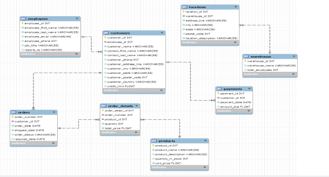

# databse_design
### Below is a database schema 

##### The database consists of 8 tables:
- employees
- customers
- orders
- order_details
- locations
- warehouse
- payments
- products
##### The tables within the database does not contain any data as of now but can be added later on, the goal of the project was to create a database from scratch and build on it moving forward. The tables are based on a sample manufacturing company and it only consists of tables that a manufacturing company might have such as keeping track of their orders and inventory or having a record of where their manufacturing sites are located. 
